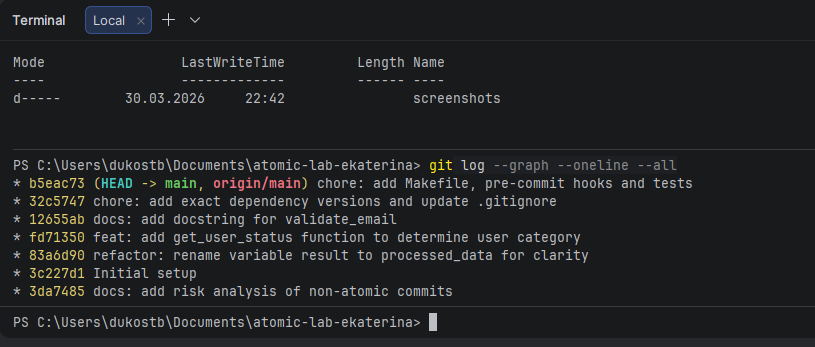
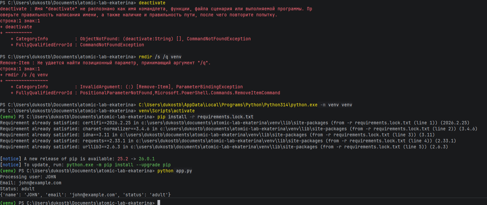
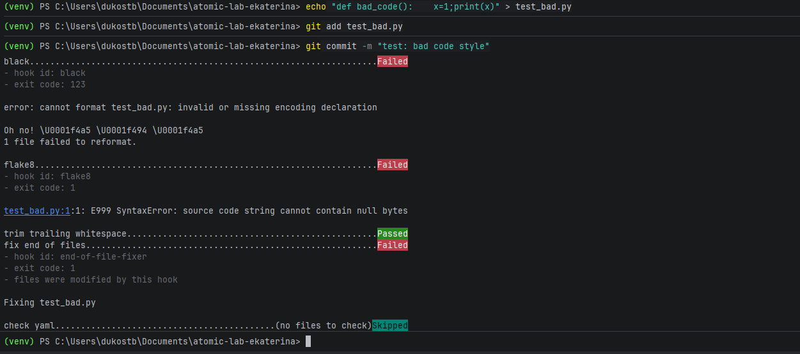

# Практическая работа: Локальный рабочий процесс

**Выполнила:** Костылева Екатерина  
**Группа:** ИС-21  
**Дата:** 30.03.2026

---

## 📎 Ссылка на репозиторий
🔗 [https://github.com/ekaterinamaludec/atomic-lab-ekaterina](https://github.com/ekaterinamaludec/atomic-lab-ekaterina)

---

## 📸 Скриншоты выполнения работы

### 1. Атомарность коммитов (git log --graph --oneline)

### 2. Чистый старт — воспроизводимость окружения

### 3. Срабатывание pre-commit хука (блокировка коммита)

---

## ❓ Ответы на контрольные вопросы

### 1. Как использование `git add -p` помогает при отладке через `git bisect`?
`git add -p` позволяет разбить большой набор изменений на несколько атомарных коммитов, каждый из которых содержит только одно логическое изменение.  
При использовании `git bisect` для поиска бага это даёт возможность точно определить коммит, который ввёл ошибку. Если бы все изменения были в одном коммите, пришлось бы вручную искать причину.

### 2. Почему `requirements.lock.txt` критичен для командной работы?
`requirements.lock.txt` фиксирует точные версии **всех** зависимостей, включая транзитивные.  
Это гарантирует, что у всех разработчиков и на production-сервере используется **идентичный набор пакетов**.  
Обычный `requirements.txt` может содержать только основные зависимости без версий, что приводит к несоответствиям окружений.

### 3. В чём преимущество Makefile перед текстовой инструкцией в README?
Makefile — это **исполняемая документация**:
- автоматизирует повторяющиеся задачи
- исключает ошибки при ручном вводе команд
- обеспечивает единообразие процессов в команде
- поддерживает зависимости между целями (например, `test` зависит от `install`)

### 4. Как тесты реализуют принцип «живой документации» и почему важна фиксация seed?
Тесты в формате **Given-When-Then** наглядно показывают ожидаемое поведение кода и всегда актуальны (в отличие от обычной документации, которая может устареть).  
Фиксация `random.seed()` делает тесты **детерминированными** — при одинаковом начальном значении результат всегда одинаков.

### 5. Что произойдёт, если удалить папку `venv` и выполнить `make install`?
При удалении `venv` и выполнении `make install`:
1. будет создано новое виртуальное окружение
2. установятся все зависимости из `requirements.lock.txt` с точными версиями
3. приложение будет работать **идентично** предыдущему запуску  
Это демонстрирует **полную воспроизводимость** окружения.

---

## ✅ Выполненные этапы

| Этап | Описание | Статус |
|------|----------|--------|
| 1 | Эмуляция нарушений и анализ | ✅ |
| 2 | Атомарность через интерактивный стейджинг | ✅ |
| 3 | Обеспечение воспроизводимости | ✅ |
| 4 | Документирование и автоматизация качества | ✅ |

---

## 📁 Состав репозитория

| Файл | Назначение |
|------|------------|
| `app.py` | основное приложение |
| `test_app.py` | тесты (Given-When-Then) |
| `Makefile` | автоматизация (install, lint, test, run) |
| `.pre-commit-config.yaml` | pre-commit хуки (black, flake8) |
| `requirements.txt` | основные зависимости с версиями |
| `requirements.lock.txt` | все зависимости с точными версиями |
| `.gitignore` | игнорируемые файлы |
| `analysis.md` | анализ рисков неатомарных коммитов |
| `README.md` | отчёт по работе |
| `screenshots/` | скриншоты выполнения |

---

## 💡 Вывод

В ходе работы были освоены:
- создание атомарных коммитов через `git add -p`
- обеспечение воспроизводимости окружения с помощью `requirements.lock.txt`
- автоматизация задач через `Makefile`
- настройка pre-commit хуков для контроля качества кода
- написание тестов как формы «живой документации»

Все этапы выполнены в полном объёме. Репозиторий готов к сдаче.
